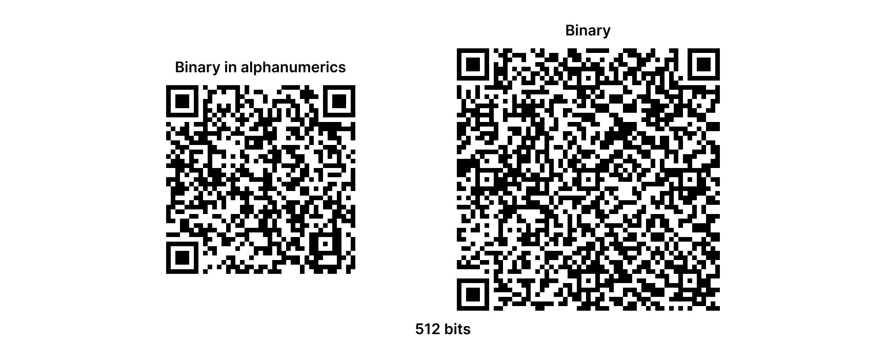

# alphanumeriqr
Compression efficient binary QR codes using safe to read alphanumerics

## Why?
* There are many different ways to create "binary" QR codes. Some camera libraries don't even see the QR code, others will not produce correct readings unless you read reconstruct the raw data.
* QR codes in all levels carry less binary data than alphanumeric data. [source](https://www.qrcode.com/en/about/version.html)

## So what do we do about it?
* We can use a safe to read alphanumeric encoding to compress the binary data into a more efficient and universally readable QR code.
* Alphanumerics contain the exact amount of characters needed to cover 5,4,3,2 bit groupings and 2 leftover characters to cover 1 and 0. This makes it perfect for compressing down bit sizes in the short to middle range.

## How do I do it?
* A basic script showcasing the concept is available in `Demo.py`